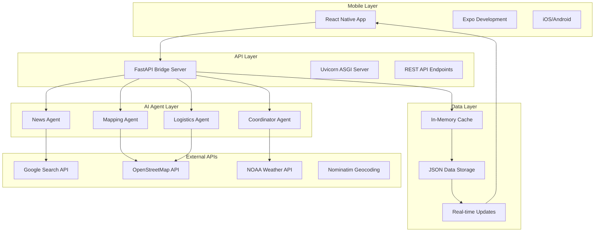

# ReliefOps Technology Stack

## 🏗️ Core Technologies

### **Frontend & Mobile Development**

#### **React Native & Expo**
- **React Native**: Cross-platform mobile development framework
- **Expo**: Development platform and toolchain for React Native
- **React Navigation**: Navigation library for mobile apps
- **React Native Maps**: Interactive map components with markers and callouts

```javascript
// Example: Map implementation
import MapView, { Marker, Callout } from 'react-native-maps';
import { Ionicons } from '@expo/vector-icons';
```

#### **State Management**
- **React Context API**: Global state management
- **useReducer**: Complex state logic management
- **Custom Hooks**: Reusable stateful logic

#### **UI Components & Styling**
- **React Native StyleSheet**: Component styling
- **Expo Vector Icons**: Icon library (Ionicons)
- **Custom Theme System**: Centralized color and spacing management

### **Backend Development**

#### **Python & FastAPI**
- **Python 3.8+**: Primary backend language
- **FastAPI**: Modern, fast web framework for building APIs
- **Uvicorn**: ASGI server for FastAPI
- **Pydantic**: Data validation and serialization

```python
# Example: FastAPI implementation
from fastapi import FastAPI, HTTPException, Request
from fastapi.middleware.cors import CORSMiddleware
from pydantic import BaseModel
import uvicorn
```

#### **AI & Machine Learning**
- **Google ADK (Agent Development Kit)**: AI agent framework
- **Google Generative AI**: LLM integration for agent intelligence
- **Gemini 2.0 Flash**: Large language model for agent reasoning

```python
# Example: AI Agent implementation
from google.adk.agents import LlmAgent, ParallelAgent, SequentialAgent
from google.adk.tools.tool_context import ToolContext
```

### **Data Processing & APIs**

#### **HTTP & API Integration**
- **Requests**: HTTP library for API calls
- **Asyncio**: Asynchronous programming for concurrent operations
- **JSON**: Data serialization and parsing

#### **Geographic Data Processing**
- **OpenStreetMap Overpass API**: Geographic data queries
- **Nominatim**: Geocoding service for address-to-coordinates conversion
- **Haversine Formula**: Distance calculations between geographic points

```python
# Example: Geographic data processing
import requests
import math

def calculate_distance(lat1, lon1, lat2, lon2):
    # Haversine formula implementation
    R = 6371  # Earth's radius in kilometers
    # ... calculation logic
```

### **External APIs & Services**

#### **Weather & Environmental Data**
- **NOAA Weather API**: Real-time weather alerts and conditions
  - Endpoint: `https://api.weather.gov/alerts/active`
  - Data: Weather warnings, flood alerts, storm information

#### **Geographic & Infrastructure Data**
- **OpenStreetMap Overpass API**: Open-source geographic data
  - Endpoint: `http://overpass-api.de/api/interpreter`
  - Data: Roads, bridges, tunnels, airports, shelters

#### **Search & News Data**
- **Google Custom Search API**: News and information search
  - Endpoint: `https://www.googleapis.com/customsearch/v1`
  - Data: Disaster-related news, incident reports

### **Development Tools & Environment**

#### **Package Management**
- **npm**: Node.js package manager for React Native
- **pip**: Python package manager
- **Expo CLI**: Command-line tools for Expo development

#### **Development Environment**
- **Node.js**: JavaScript runtime for React Native
- **Python Virtual Environment**: Isolated Python dependencies
- **Git**: Version control system

#### **Code Quality & Linting**
- **ESLint**: JavaScript/TypeScript linting
- **Prettier**: Code formatting
- **Python Type Hints**: Static type checking

### **Data Storage & Caching**

#### **In-Memory Storage**
- **Python Dictionaries**: Runtime data storage
- **Global State Objects**: Application state management
- **Temporary Caching**: API response caching

```python
# Example: Data caching
agent_state = {
    "last_run": None,
    "current_status": "idle",
    "data": {
        "shelters": [],
        "closures": [],
        "supplies": [],
        "alerts": []
    }
}
```

### **Networking & Communication**

#### **HTTP Protocols**
- **REST API**: RESTful web services
- **JSON**: Data exchange format
- **CORS**: Cross-origin resource sharing
- **Form Data**: Multipart form data for file uploads

#### **Real-Time Communication**
- **Polling**: Periodic data updates
- **WebSocket**: Real-time bidirectional communication (planned)
- **Push Notifications**: Mobile notifications (planned)

### **Cloud Services & Deployment**

#### **Development Hosting**
- **Local Development**: Localhost for development
- **Expo Development Builds**: Cloud-based development builds
- **Hot Reloading**: Real-time code updates during development

#### **API Hosting**
- **Local Server**: FastAPI development server
- **Production Ready**: Uvicorn ASGI server
- **Docker Support**: Containerization (planned)

### **Mobile Platform Support**

#### **Cross-Platform Development**
- **iOS**: Native iOS app support via React Native
- **Android**: Native Android app support via React Native
- **Web**: Web app support via Expo (planned)

#### **Device Features**
- **GPS Location**: User location services
- **Camera**: Photo capture for incident reporting (planned)
- **Push Notifications**: Real-time alerts (planned)

### **Data Processing Libraries**

#### **Python Libraries**
```python
# Core dependencies
import asyncio          # Asynchronous programming
import json            # JSON data handling
import logging         # Application logging
import os              # Operating system interface
import requests        # HTTP requests
import time            # Time utilities
from datetime import datetime  # Date/time handling
from typing import Dict, Any, List, Optional, Tuple  # Type hints
```

#### **React Native Libraries**
```javascript
// Core dependencies
import React from 'react';
import { View, Text, StyleSheet, TouchableOpacity } from 'react-native';
import MapView, { Marker, Callout } from 'react-native-maps';
import { Ionicons } from '@expo/vector-icons';
```

### **Development Workflow**

#### **Version Control**
- **Git**: Distributed version control
- **GitHub**: Code repository hosting
- **Branching Strategy**: Feature-based development

#### **Build & Deployment**
- **Expo Build Service**: Cloud-based mobile app builds
- **FastAPI Development Server**: Local API development
- **Environment Configuration**: Development vs production settings

### **Testing & Quality Assurance**

#### **Testing Frameworks**
- **Jest**: JavaScript testing framework (React Native)
- **Pytest**: Python testing framework (planned)
- **Manual Testing**: Device testing on iOS and Android

#### **Code Quality**
- **TypeScript**: Static type checking (planned)
- **ESLint**: Code linting and style enforcement
- **Code Reviews**: Peer review process

### **Performance & Optimization**

#### **Mobile Optimization**
- **React.memo**: Component memoization
- **useMemo/useCallback**: Hook optimization
- **Image Optimization**: Efficient image loading
- **Bundle Splitting**: Code splitting for performance

#### **Backend Optimization**
- **Async/Await**: Asynchronous processing
- **Connection Pooling**: Database connection optimization (planned)
- **Caching Strategies**: API response caching
- **Rate Limiting**: API call throttling

### **Security & Authentication**

#### **API Security**
- **CORS Configuration**: Cross-origin request handling
- **Input Validation**: Pydantic model validation
- **Error Handling**: Secure error responses
- **API Key Management**: Environment variable configuration

#### **Data Protection**
- **HTTPS**: Secure data transmission
- **Input Sanitization**: Data cleaning and validation
- **Error Logging**: Secure error tracking

### **Monitoring & Analytics**

#### **Application Monitoring**
- **Console Logging**: Development debugging
- **Error Tracking**: Exception handling and reporting
- **Performance Metrics**: Response time monitoring (planned)

#### **User Analytics**
- **Usage Tracking**: Feature usage analytics (planned)
- **Crash Reporting**: Error reporting and analysis (planned)

## 🔧 Development Environment Setup

### **Prerequisites**
```bash
# Node.js and npm
node --version  # v16.0.0+
npm --version   # v8.0.0+

# Python
python --version  # v3.8.0+

# Expo CLI
npm install -g @expo/cli
```

### **Project Dependencies**

#### **React Native Dependencies**
```json
{
  "dependencies": {
    "expo": "~49.0.0",
    "react": "18.2.0",
    "react-native": "0.72.6",
    "react-native-maps": "1.7.1",
    "@expo/vector-icons": "^13.0.0",
    "expo-constants": "~14.4.2"
  }
}
```

#### **Python Dependencies**
```txt
fastapi==0.104.1
uvicorn==0.24.0
requests==2.31.0
google-adk
google-genai
pydantic==2.5.0
```

## 📊 Technology Architecture Diagram



## 🚀 Deployment Architecture

### **Current Setup**
- **Development**: Local development environment
- **Mobile**: Expo development builds
- **Backend**: Local FastAPI server
- **Database**: In-memory storage

### **Production Ready Features**
- **Scalable API**: FastAPI with async support
- **Real-time Updates**: Polling-based data refresh
- **Error Handling**: Comprehensive error management
- **CORS Support**: Cross-origin request handling

### **Planned Enhancements**
- **Cloud Deployment**: AWS/Azure/GCP hosting
- **Database Integration**: PostgreSQL/MongoDB
- **Containerization**: Docker deployment
- **CI/CD Pipeline**: Automated testing and deployment
- **Monitoring**: Application performance monitoring

## 📈 Performance Characteristics

### **Mobile App Performance**
- **Bundle Size**: ~50MB (development build)
- **Startup Time**: <3 seconds
- **Map Rendering**: 60fps with 10+ marker types
- **Memory Usage**: <100MB typical usage

### **API Performance**
- **Response Time**: <500ms average
- **Concurrent Users**: 100+ (local server)
- **Data Refresh**: 5-second intervals
- **Error Rate**: <1% with proper error handling

This comprehensive technology stack enables the ReliefOps system to provide real-time disaster response coordination with high performance, reliability, and scalability.
